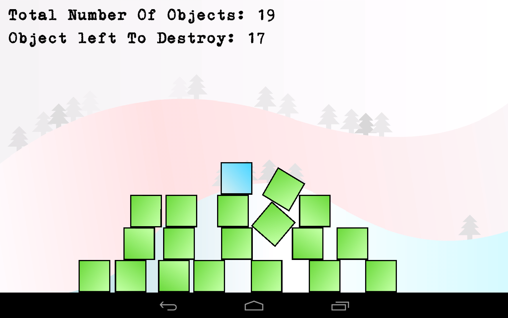
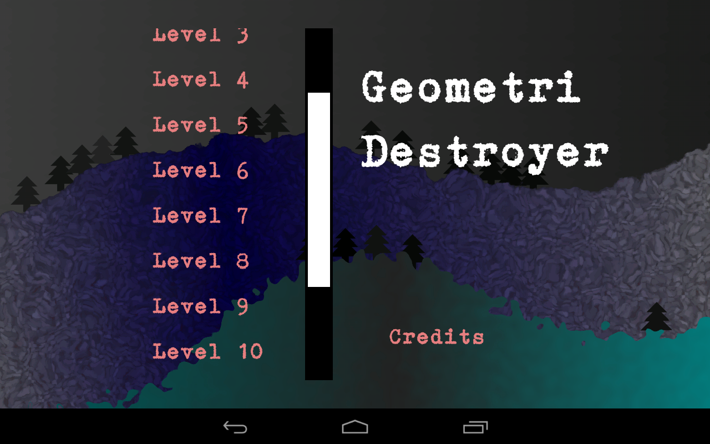
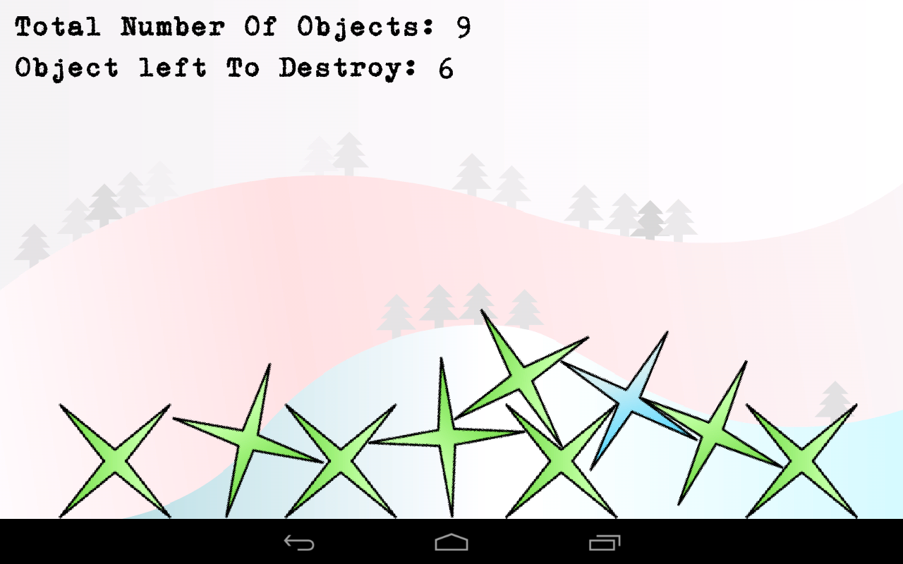
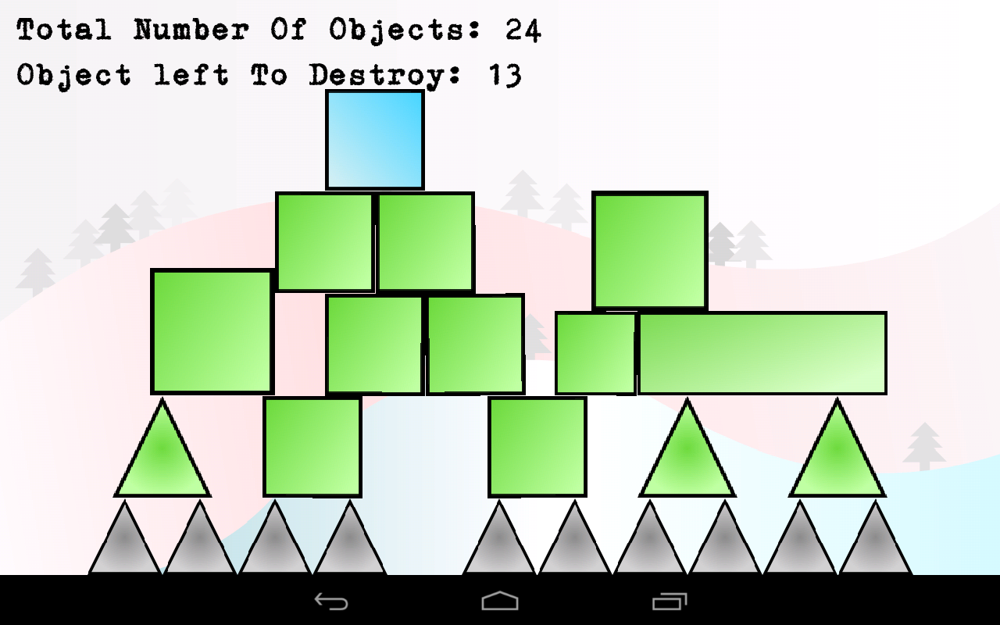

# Geometri Destroyer

Author: Daniel "MaTachi" Jonsson  
Tools: Eclipse, GIMP, Inkscape  
Development platform: Ubuntu 12.10  
Libraries: LibGDX, Box2D  
Made during February 2013 for One Game A Month

  
  
  

## Install on your Android device from Google Play

Geometri Destroyer is [available on Google
Play](https://play.google.com/store/apps/details?id=se.danielj.geometridestroyer)
for your Android device.

## Licenses

The code I have written is licensed under [GNU GPLv3](LICENSE.txt). The images
I have made, which are all in [images/](images/), [images-dev/](images-dev/)
and [images-play/](images-play/) except the One Game A Month logo, are licensed
under Creative Commons Attribution-ShareAlike 3.0 Unported ([CC BY-SA
3.0](http://creativecommons.org/licenses/by-sa/3.0/)).

LibGDX is available under Apache License 2.0
[[link](https://code.google.com/p/libgdx/)].  
Box2D is available under zlib License. [[link](http://box2d.org/about/)].

The font being used is GNUTypewriter which licensed under [SIL Open Font
License](http://scripts.sil.org/cms/scripts/page.php?site_id=nrsi&id=OFL) and
can be downloaded from [this
page](http://openfontlibrary.org/font/gnutypewriter).

The background music is Fallen by Szymon Matuszewski, licensed under CC BY 3.0
and available for download on [this
page](http://opengameart.org/content/classicmusicpack).

## Texture packer

    rm geometri-destroyer-android/assets/sprites/sprites.{atlas,png} ; java -classpath geometri-destroyer/libs/gdx.jar:geometri-destroyer/libs/gdx-tools.jar com.badlogic.gdx.tools.imagepacker.TexturePacker2 images geometri-destroyer-android/assets/sprites sprites

